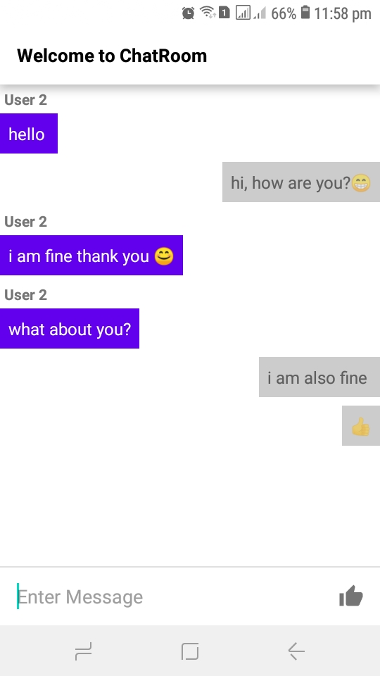
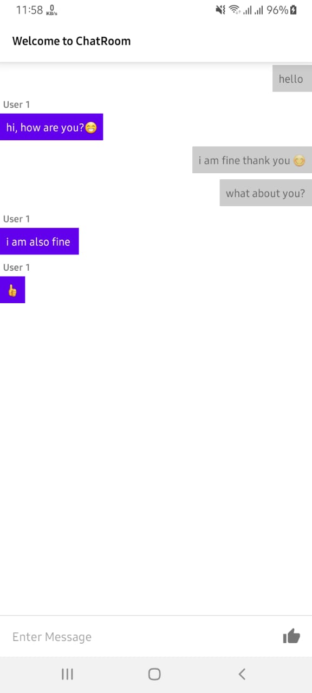

## General

Simple Chat app using Websockets build with kotlin and Okhttp3

## Specs / Open-source libraries:

- Minimum **SDK 21**, _but AppCompat is used all the way ;-)_
- [**Kotlin**](https://github.com/JetBrains/kotlin) all new modules starting from 2.5.3 will be written in **#Kotlin**.
- [**Okhttp3**](https://github.com/square/okhttp) HTTP client
- [**Okhttp3-web-socket**](https://square.github.io/okhttp/4.x/okhttp/okhttp3/-web-socket/) A non-blocking interface to a web socket
- [**websocket**](https://www.npmjs.com/package/websocket) WebSocket Client & Server for Node

### Installing

```
npm install -g websocket
```

### Script location

```
└── Chat/
    └── server/
        └── server.js
```

### Run

```
node server.js [port]
```

### Screenshots

|                           User 1                           |                           User 2                           |
| :--------------------------------------------------------: | :--------------------------------------------------------: |
|  > |  > |
